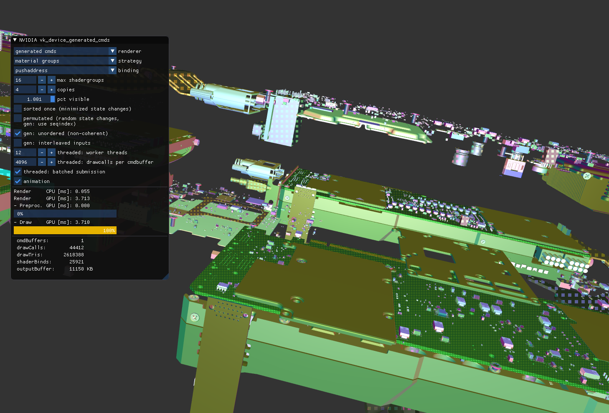

# Vulkan Device Generated Commands Sample


# Vulkan Device Generated Commands Sample

This branch is the [Circle C++ shaders](https://github.com/seanbaxter/shaders/blob/master/README.md) port 
of [Christoph Kubisch](https://twitter.com/pixeljetstream)'s **[Vulkan device generated commands sample](https://github.com/nvpro-samples/vk_device_generated_cmds/)**.

Compile with [Circle build 113](https://www.circle-lang.org/)

To build, point cmake at circle:

```
$ cmake -DCMAKE_CXX_COMPILER=circle ..
$ make -j6
```

